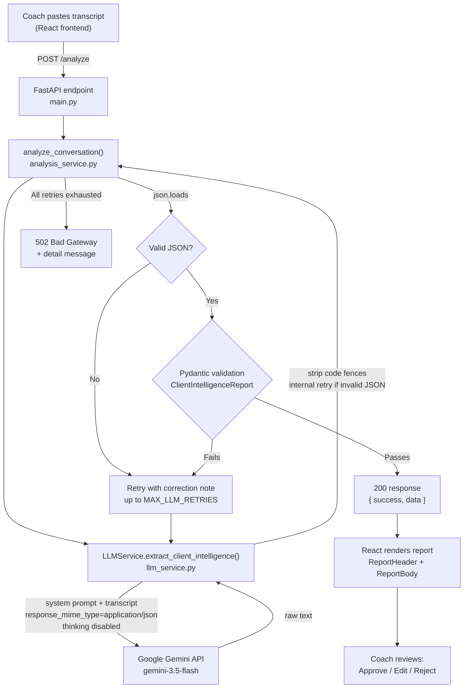

# Prompt / Workflow

**Project:** FUME Client Intelligence Platform (Prototype)
**Stack:** React (frontend) · FastAPI (backend) · Google Gemini `gemini-3.5-flash` (LLM)

This document explains the end-to-end path from a pasted coach-client
transcript to a rendered, evidence-grounded report, how the Gemini
call is constructed, and how invalid output is caught before it ever
reaches a coach.

---

## 1. End-to-end workflow

1. A coach pastes a raw transcript into the React frontend
   (`TranscriptInputPanel.jsx`) and submits it.
2. The frontend sends `POST /analyze` with `{ "conversation": "<text>" }`
   (`src/api/analyzeClient.js`).
3. FastAPI (`backend/app/main.py`) validates the request body against
   `AnalyzeRequest`, then calls `analyze_conversation()`.
4. `analysis_service.py` orchestrates the pipeline: it calls the LLM
   service, parses the returned text as JSON, validates it against the
   `ClientIntelligenceReport` Pydantic schema, and retries with a
   corrective instruction if either step fails (bounded by
   `MAX_LLM_RETRIES`, default 2).
5. `llm_service.py` is the only module that talks to Gemini. It sends
   the system prompt + transcript, strips any markdown code fences,
   and does one internal retry of its own if the raw response isn't
   parseable JSON (independent of, and in addition to,
   `analysis_service.py`'s retry loop).
6. On success, FastAPI returns `200 { success: true, data: <report> }`.
   On failure after all retries, it returns `502` with a descriptive
   `detail` message — never a `200` with fabricated or partially
   invented data.
7. The frontend renders the validated report: a header with the weekly
   summary, one card per finding (value, classification badge,
   confidence bar, expandable evidence), and a sticky
   Approve / Edit / Reject bar at the bottom.

## 2. Architecture diagram

## 3. How the prompt works

The system prompt (`backend/app/prompts/system_prompt.py`) is sent as
Gemini's `system_instruction` on every call. It defines the model's
role as a data-extraction analyst, not an advisor, and enforces a
fixed set of rules:

- **No invention.** Every factual claim must trace back to a quoted
  line in the transcript. If a claim can't be backed by a real quote,
  it must be marked `missing_information` instead of stated.
- **A four-way classification test**, applied to every finding in a
  fixed order: is it an exact statement from a coach/system role
  (`confirmed_fact`), the client's own self-report
  (`client_reported`), something the model derived by combining
  multiple data points (`ai_inference`), or absent from the transcript
  entirely (`missing_information`)? A fifth tag,
  `conflicting_reports`, is used when two messages contradict each
  other — both are reported rather than one being silently picked.
- **Confidence bands** (0.9–1.0 explicit fact, 0.6–0.89 clear
  qualitative statement, 0.3–0.59 weak inference, below 0.3 →
  discard and mark missing) so confidence reflects how directly the
  transcript supports the claim, not general fluency.
- **Mandatory evidence** — every non-missing field must carry at
  least one `{day, speaker, quote}` object, and risk flags /
  conflicting reports require a minimum of 1 and 2 evidence items
  respectively.
- **Strict output shape** — a fixed JSON schema, no markdown fences,
  no commentary before or after the JSON object.

The prompt is provider-agnostic — it does not reference Gemini by
name — which is why it was unchanged when the LLM provider was swapped
from Anthropic Claude to Ollama to Gemini during development.

## 4. How Gemini is called

`llm_service.py` uses the official `google-genai` Python SDK
(`google.genai.Client`). Each call:

- Sends the system prompt via `system_instruction` and the transcript
  (plus, on a validation-retry, a correction note describing what was
  wrong last time) as `contents`.
- Sets `response_mime_type="application/json"` — a Gemini-level
  constraint that the output must be syntactically valid JSON, on top
  of the prompt's own JSON-only instruction.
- Sets `temperature=0` for deterministic, repeatable extraction.
- Sets `thinking_config=ThinkingConfig(thinking_budget=0)` to disable
  Gemini's internal "thinking" tokens for this call. Thinking tokens
  count against the same `max_output_tokens` budget as the answer
  itself; for a long JSON schema, uncontrolled thinking was found
  during development to consume most of the budget and truncate the
  JSON output mid-object. If a given model rejects this parameter
  (some model families cannot disable thinking), the call is retried
  once without it.
- Sets `max_output_tokens=8192` as a second, independent safety
  margin against truncation.
- Wraps every failure mode — Gemini API errors (`ClientError` /
  `ServerError`), timeouts, empty responses, and transport-level
  failures — into a single `LLMServiceError`, logged with enough
  detail (error code, message, token usage, finish reason) to debug
  from the backend logs alone.

## 5. JSON validation and retry logic

Two independent layers exist, at two different points in the pipeline:

**Inside `llm_service.py` (provider layer).** After receiving a
response, code fences are stripped and the text is checked with
`json.loads()`. If it fails, the raw Gemini call is retried once —
a fresh generation, not a re-prompt — before the (possibly still
invalid) text is handed back up.

**Inside `analysis_service.py` (orchestration layer).** This is the
authoritative retry loop, bounded by `MAX_LLM_RETRIES` (default 2,
so up to 3 total attempts):
1. Strip any remaining markdown fences and extract the outermost
   `{ ... }` object.
2. `json.loads()` the result. On failure, capture the error and loop
   again — this time appending a correction note to the prompt
   describing exactly what went wrong, so the next Gemini call can
   self-correct.
3. On successful parse, backfill `report_id` and `client_id`
   deterministically in code (never trusted from the LLM, since these
   are identifiers, not analytical findings).
4. Validate the parsed object against `ClientIntelligenceReport`
   (Pydantic). This is where hallucination is caught structurally:
   every classification must be one of five fixed enum values,
   confidence must be `0.0–1.0`, and — critically — the custom
   `GradedField` validator **rejects any field whose classification
   isn't `missing_information` if it has zero evidence items**. A
   claim with no supporting quote cannot pass validation, regardless
   of how well-written it is.
5. If validation fails, the specific Pydantic error becomes the next
   correction note, and the loop repeats.
6. If all attempts are exhausted, `analyze_conversation()` raises
   `AnalysisError`, which the FastAPI layer turns into a `502` with a
   descriptive message. The endpoint never returns `200` with
   unvalidated or partially fabricated data.

## 6. Why confidence scores and evidence are generated

Both exist to solve the same underlying problem: an LLM summary is
unfalsifiable by default — a coach has no way to tell which sentences
are grounded and which are the model's best guess dressed up as fact.

- **Evidence** (`day`, `speaker`, `quote`) makes every claim
  independently checkable against the source transcript. It also
  changes model behavior upstream: being required to produce a real
  quote is a much easier constraint for the model to satisfy honestly
  than an abstract instruction to "be accurate," because it can't
  cite a quote that doesn't exist.
- **Confidence scores** communicate *how directly* the evidence
  supports the claim, separating "the accountability coach logged this
  number" (high confidence, `confirmed_fact`) from "the model connected
  two indirect signals to infer a trend" (lower confidence,
  `ai_inference`). This lets the frontend and the coach weight claims
  appropriately instead of treating every line of the report as
  equally certain.

Together, they turn the report from "an LLM read the transcript and
wrote something plausible" into something a coach can audit line by
line before acting on it.
