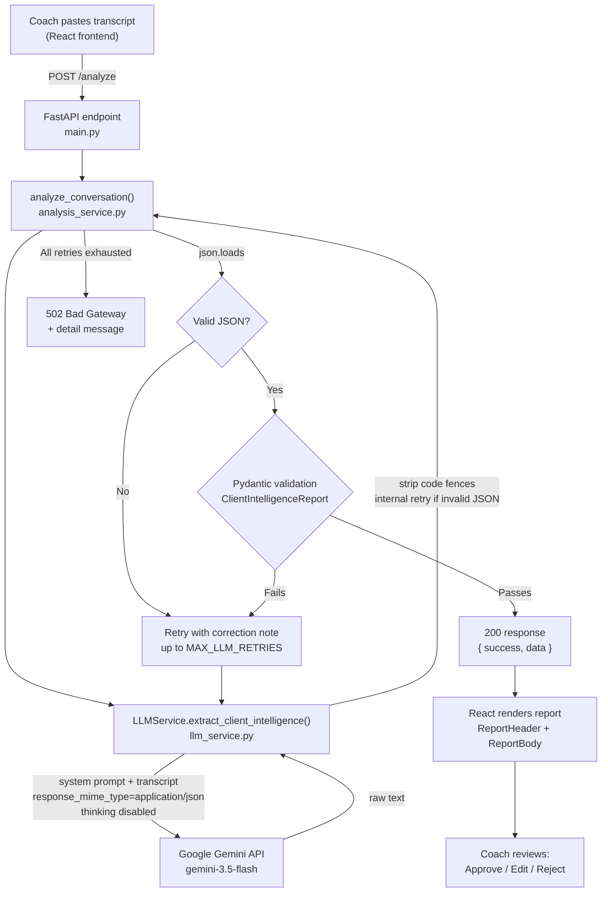

# FUME Client Intelligence Assignment
## Demo Video Link
https://drive.google.com/file/d/1ZP7f4zyTzt25ydONrpyHuU58ERxDLCz0/view?usp=sharing

## Prompt / Workflow

**Project:** FUME Client Intelligence Platform (Prototype)
**Stack:** React (frontend) · FastAPI (backend) · Google Gemini `gemini-3.5-flash` (LLM)

This document explains the end-to-end path from a pasted coach-client
transcript to a rendered, evidence-grounded report, how the Gemini
call is constructed, and how invalid output is caught before it ever
reaches a coach.

---

## 1. End-to-end workflow

1. A coach pastes a raw transcript into the React frontend
   (`TranscriptInputPanel.jsx`) and submits it.
2. The frontend sends `POST /analyze` with `{ "conversation": "<text>" }`
   (`src/api/analyzeClient.js`).
3. FastAPI (`backend/app/main.py`) validates the request body against
   `AnalyzeRequest`, then calls `analyze_conversation()`.
4. `analysis_service.py` orchestrates the pipeline: it calls the LLM
   service, parses the returned text as JSON, validates it against the
   `ClientIntelligenceReport` Pydantic schema, and retries with a
   corrective instruction if either step fails (bounded by
   `MAX_LLM_RETRIES`, default 2).
5. `llm_service.py` is the only module that talks to Gemini. It sends
   the system prompt + transcript, strips any markdown code fences,
   and does one internal retry of its own if the raw response isn't
   parseable JSON (independent of, and in addition to,
   `analysis_service.py`'s retry loop).
6. On success, FastAPI returns `200 { success: true, data: <report> }`.
   On failure after all retries, it returns `502` with a descriptive
   `detail` message — never a `200` with fabricated or partially
   invented data.
7. The frontend renders the validated report: a header with the weekly
   summary, one card per finding (value, classification badge,
   confidence bar, expandable evidence), and a sticky
   Approve / Edit / Reject bar at the bottom.

## 2. Architecture diagram



## 3. How the prompt works

The system prompt (`backend/app/prompts/system_prompt.py`) is sent as
Gemini's `system_instruction` on every call. It defines the model's
role as a data-extraction analyst, not an advisor, and enforces a
fixed set of rules:

- **No invention.** Every factual claim must trace back to a quoted
  line in the transcript. If a claim can't be backed by a real quote,
  it must be marked `missing_information` instead of stated.
- **A four-way classification test**, applied to every finding in a
  fixed order: is it an exact statement from a coach/system role
  (`confirmed_fact`), the client's own self-report
  (`client_reported`), something the model derived by combining
  multiple data points (`ai_inference`), or absent from the transcript
  entirely (`missing_information`)? A fifth tag,
  `conflicting_reports`, is used when two messages contradict each
  other — both are reported rather than one being silently picked.
- **Confidence bands** (0.9–1.0 explicit fact, 0.6–0.89 clear
  qualitative statement, 0.3–0.59 weak inference, below 0.3 →
  discard and mark missing) so confidence reflects how directly the
  transcript supports the claim, not general fluency.
- **Mandatory evidence** — every non-missing field must carry at
  least one `{day, speaker, quote}` object, and risk flags /
  conflicting reports require a minimum of 1 and 2 evidence items
  respectively.
- **Strict output shape** — a fixed JSON schema, no markdown fences,
  no commentary before or after the JSON object.

The prompt is provider-agnostic — it does not reference Gemini by
name — which is why it was unchanged when the LLM provider was swapped
from Anthropic Claude to Ollama to Gemini during development.

## 4. How Gemini is called

`llm_service.py` uses the official `google-genai` Python SDK
(`google.genai.Client`). Each call:

- Sends the system prompt via `system_instruction` and the transcript
  (plus, on a validation-retry, a correction note describing what was
  wrong last time) as `contents`.
- Sets `response_mime_type="application/json"` — a Gemini-level
  constraint that the output must be syntactically valid JSON, on top
  of the prompt's own JSON-only instruction.
- Sets `temperature=0` for deterministic, repeatable extraction.
- Sets `thinking_config=ThinkingConfig(thinking_budget=0)` to disable
  Gemini's internal "thinking" tokens for this call. Thinking tokens
  count against the same `max_output_tokens` budget as the answer
  itself; for a long JSON schema, uncontrolled thinking was found
  during development to consume most of the budget and truncate the
  JSON output mid-object. If a given model rejects this parameter
  (some model families cannot disable thinking), the call is retried
  once without it.
- Sets `max_output_tokens=8192` as a second, independent safety
  margin against truncation.
- Wraps every failure mode — Gemini API errors (`ClientError` /
  `ServerError`), timeouts, empty responses, and transport-level
  failures — into a single `LLMServiceError`, logged with enough
  detail (error code, message, token usage, finish reason) to debug
  from the backend logs alone.

## 5. JSON validation and retry logic

Two independent layers exist, at two different points in the pipeline:

**Inside `llm_service.py` (provider layer).** After receiving a
response, code fences are stripped and the text is checked with
`json.loads()`. If it fails, the raw Gemini call is retried once —
a fresh generation, not a re-prompt — before the (possibly still
invalid) text is handed back up.

**Inside `analysis_service.py` (orchestration layer).** This is the
authoritative retry loop, bounded by `MAX_LLM_RETRIES` (default 2,
so up to 3 total attempts):
1. Strip any remaining markdown fences and extract the outermost
   `{ ... }` object.
2. `json.loads()` the result. On failure, capture the error and loop
   again — this time appending a correction note to the prompt
   describing exactly what went wrong, so the next Gemini call can
   self-correct.
3. On successful parse, backfill `report_id` and `client_id`
   deterministically in code (never trusted from the LLM, since these
   are identifiers, not analytical findings).
4. Validate the parsed object against `ClientIntelligenceReport`
   (Pydantic). This is where hallucination is caught structurally:
   every classification must be one of five fixed enum values,
   confidence must be `0.0–1.0`, and — critically — the custom
   `GradedField` validator **rejects any field whose classification
   isn't `missing_information` if it has zero evidence items**. A
   claim with no supporting quote cannot pass validation, regardless
   of how well-written it is.
5. If validation fails, the specific Pydantic error becomes the next
   correction note, and the loop repeats.
6. If all attempts are exhausted, `analyze_conversation()` raises
   `AnalysisError`, which the FastAPI layer turns into a `502` with a
   descriptive message. The endpoint never returns `200` with
   unvalidated or partially fabricated data.

## 6. Why confidence scores and evidence are generated

Both exist to solve the same underlying problem: an LLM summary is
unfalsifiable by default — a coach has no way to tell which sentences
are grounded and which are the model's best guess dressed up as fact.

- **Evidence** (`day`, `speaker`, `quote`) makes every claim
  independently checkable against the source transcript. It also
  changes model behavior upstream: being required to produce a real
  quote is a much easier constraint for the model to satisfy honestly
  than an abstract instruction to "be accurate," because it can't
  cite a quote that doesn't exist.
- **Confidence scores** communicate *how directly* the evidence
  supports the claim, separating "the accountability coach logged this
  number" (high confidence, `confirmed_fact`) from "the model connected
  two indirect signals to infer a trend" (lower confidence,
  `ai_inference`). This lets the frontend and the coach weight claims
  appropriately instead of treating every line of the report as
  equally certain.

Together, they turn the report from "an LLM read the transcript and
wrote something plausible" into something a coach can audit line by
line before acting on it.


## JSON Schema

This document describes the JSON schema actually enforced by the
backend (`backend/app/models/schemas.py`, Pydantic models) — this is
not an aspirational schema, it is the exact contract the LLM output is
validated against before any response reaches the frontend.

---

## 1. Complete schema (reference form)

```json
{
  "client_id": "string",
  "report_id": "string",
  "period": {
    "start_day": "string",
    "end_day": "string",
    "days_covered": ["string"]
  },

  "weekly_summary": { "value": "...", "classification": "...", "confidence": 0.0, "evidence": [ {"day": "...", "speaker": "...", "quote": "..."} ] },

  "nutrition": {
    "adherence": "<GradedField>",
    "notes": "<GradedField>"
  },
  "exercise": {
    "steps": "<GradedField>",
    "activity_type": "<GradedField>",
    "consistency": "<GradedField>"
  },
  "sleep": {
    "average_hours": "<GradedField>",
    "quality_notes": "<GradedField>"
  },
  "water": "<GradedField>",
  "symptoms": {
    "reported_symptoms": "<GradedField>",
    "frequency_pattern": "<GradedField>"
  },
  "stress": "<GradedField>",
  "engagement": {
    "level": "<GradedField>",
    "responsiveness": "<GradedField>",
    "missed_checkins": "<GradedField>"
  },

  "key_barriers": [ { "description": "string", "classification": "...", "confidence": 0.0, "evidence": [ "..." ] } ],
  "pending_actions": [ { "description": "string", "source": "coach|client|accountability_coach", "status": "open|completed|carried_over", "classification": "...", "confidence": 0.0, "evidence": [ "..." ] } ],
  "risk_flags": [ { "flag": "string", "severity": "low|medium|high", "rule_triggered": "string", "classification": "...", "confidence": 0.0, "evidence": [ "min 1 item" ] } ],
  "coach_recommendations": [ { "recommendation": "string", "priority": "low|medium|high", "classification": "...", "confidence": 0.0, "evidence": [ "..." ] } ],
  "conflicting_reports": [ { "description": "string", "classification": "conflicting_reports", "evidence": [ "min 2 items" ] } ],
  "missing_information": [ { "category": "string", "note": "string" } ]
}
```

Where `<GradedField>` is the repeated building block:

```json
{
  "value": "string | number | boolean | array | null",
  "classification": "confirmed_fact | client_reported | ai_inference | missing_information | conflicting_reports",
  "confidence": 0.0,
  "evidence": [
    { "day": "string", "speaker": "string (optional)", "quote": "string, max 300 chars" }
  ]
}
```

Full HTTP response envelope (`AnalyzeResponse`):

```json
{
  "success": true,
  "data": "<ClientIntelligenceReport, as above, present only on success>",
  "error": null
}
```

> Note on `error`: the field exists on the response model for
> forward compatibility, but the current implementation does not
> populate it — failures are communicated via HTTP status code
> (`502`/`500`) plus a `detail` message in the FastAPI error response,
> not via a `200` with `success: false`. This is documented explicitly
> so the schema matches actual behavior rather than an aspirational
> design.

## 2. Explanation of major fields

### Top level

| Field | Purpose |
|---|---|
| `client_id`, `report_id` | Identifiers. Deliberately **not** trusted from the LLM — `analysis_service.py` backfills these deterministically after parsing, since an identifier is not an analytical finding and shouldn't be subject to model variance. |
| `period` | The day range covered, plus the explicit list of days present in the transcript. Anchors every other field to a concrete time window rather than a vague "this week." |
| `weekly_summary` | A single `GradedField` — a short narrative synthesis, still required to carry evidence and a classification like every other finding, so it can't become a place for the model to make claims it can't back up elsewhere in the report. |

### The `GradedField` pattern

This is the core design decision in the schema (see §3). Every
individual metric — nutrition adherence, step count, sleep hours,
water intake, symptom pattern, stress, each engagement dimension — is
a `GradedField` with exactly four keys:

- **`value`** — the extracted finding itself, in the model's own
  words or as a number. `null`/empty only makes sense when
  `classification` is `missing_information`.
- **`classification`** — which of the five categories the finding
  belongs to (see below).
- **`confidence`** — `0.0–1.0`, how directly the transcript supports
  this specific claim.
- **`evidence`** — an array of `{day, speaker, quote}` objects. The
  schema enforces (via a custom validator) that this array cannot be
  empty unless `classification` is `missing_information` — a claim
  with no evidence simply cannot pass validation.

### Classification enum (five values)

| Value | Meaning |
|---|---|
| `confirmed_fact` | Stated as objective fact by a coach/accountability coach, or a structured numeric log entry. |
| `client_reported` | The client's own self-report — a real thing they said, but not independently verified. |
| `ai_inference` | A pattern or judgment the model derived by connecting two or more data points. Must cite everything it was derived from. |
| `missing_information` | The category was not addressed anywhere in the transcript. |
| `conflicting_reports` | Two or more statements contradict each other; both sides are reported rather than one being silently discarded. |

### Category groupings (`nutrition`, `exercise`, `sleep`, `symptoms`, `engagement`)

Each groups 2–3 related `GradedField`s under one object (e.g.
`exercise.steps`, `exercise.activity_type`, `exercise.consistency`).
`water` and `stress` are single `GradedField`s at the top level since
they didn't need sub-breakdown for this transcript format.

### List-based sections

| Field | Extra fields beyond the `GradedField` base | Notes |
|---|---|---|
| `key_barriers` | `description` | Recurring obstacles the client faces. |
| `pending_actions` | `description`, `source` (coach/client/accountability_coach), `status` (open/completed/carried_over) | Tracks commitments made in the conversation. |
| `risk_flags` | `flag`, `severity` (low/medium/high), `rule_triggered` | **Minimum 1 evidence item enforced by the schema.** `rule_triggered` requires the model to state the explicit threshold that justified the flag (e.g. "sleep < 6h on 3+ of the last 7 days"), rather than raising a flag on tone alone. |
| `coach_recommendations` | `recommendation`, `priority` (low/medium/high) | Suggested next actions for the coach, still evidence-linked. |
| `conflicting_reports` | `description` | **Minimum 2 evidence items enforced by the schema** — a conflict by definition needs two conflicting statements shown side by side. |
| `missing_information` | `category`, `note` | Explicit "no data" entries — every relevant category should be represented here if the transcript is silent on it, so an absence is a stated fact, not a silent omission. |

## 3. Why this schema was chosen

- **A single reusable `GradedField` unit** rather than one bespoke
  shape per category keeps the whole report internally consistent —
  the frontend has exactly one card component
  (`GradedFieldCard.jsx`) that renders every metric identically, and
  every metric in the report is auditable the same way.
- **Evidence is structural, not optional.** By encoding "no evidence
  ⇒ invalid unless missing" as a Pydantic validator rather than a
  prompt instruction, grounding is enforced by code that cannot be
  talked out of it by a persuasive but unsupported LLM response.
- **A fixed five-value classification enum**, rather than free-text
  labels, means the frontend can map classification directly to a
  consistent color/badge system (`utils/classification.js`) and the
  backend can validate it with a plain enum check — no fuzzy string
  matching required anywhere in the pipeline.
- **Minimum evidence counts on `risk_flags` (1) and
  `conflicting_reports` (2)** reflect that these are the two highest-
  stakes, highest-scrutiny output types — a risk flag with zero
  evidence, or a "conflict" backed by only one quote, is not just
  weak, it's incoherent, so the schema refuses to accept it rather
  than relying on the model to remember the rule.
- **`missing_information` as a first-class, always-populatable list**
  removes the incentive for the model to fill silence with a
  plausible-sounding guess — saying "no data" is a fully valid answer
  the schema expects, not an omission to be avoided.
- **Deterministic backfill of `report_id`/`client_id`** keeps
  identifiers out of the LLM's hands entirely, since these need to be
  stable and code-generated, not subject to model phrasing variance.


## Failure Scenarios
# Hallucination / Failure Scenarios

Three realistic failure modes for this system, each grounded in the
actual sample transcript used during development and, where
applicable, an incident that genuinely occurred while building this
prototype (Scenario 2). For each: description, an example transcript
excerpt, what incorrect LLM behavior would look like, the impact if it
reached a coach unfiltered, what this implementation currently does
about it, and what a production version should add.

---

## Scenario 1: Hallucinated / Unsupported Claim

### Description
The model states something about the client that sounds plausible and
consistent with the general tone of the conversation, but is not
actually supported by anything said in the transcript — e.g.
inferring a medical cause, a trend, or a quantified detail that was
never stated.

### Example transcript excerpt
```
Day 5
Client: Weight seems slightly up even though I'm eating almost half of what I used to eat.
Coach: It is not always about eating less. Your body needs adequate nutrition.
```

### Incorrect LLM behavior
The model writes something like: *"Client's weight gain is likely due
to a slowed metabolism from prolonged undereating, indicating a
possible metabolic adaptation risk,"* and tags it `confirmed_fact` —
none of this is stated anywhere in the transcript; it's a plausible-
sounding medical explanation the model generated from general
knowledge, not from the conversation.

### Impact
A coach could treat this as an established fact about the client's
physiology and adjust the nutrition plan around it, when the
transcript actually contains no such information — the client only
reported a subjective impression of gaining weight.

### Current mitigation in this implementation
- The prompt explicitly forbids stating anything not traceable to a
  quoted line, and forbids diagnosing or assigning medical causes at
  all.
- Every non-missing `GradedField` in the Pydantic schema **requires**
  at least one `evidence` item with a real quote — this specific
  fabricated claim would need a quote from the transcript to pass
  validation, and none exists, so if the model tried to cite
  something, the citation itself would either be fabricated (and
  therefore not string-verifiable against the source in a future
  grounding check) or the field would fail the "evidence required"
  validator and be rejected.
- Confidence banding pushes weak/unsupported inferences toward
  `missing_information` rather than a confident-sounding claim.

### Future improvement
Add a deterministic **grounding check**: after parsing, verify that
each `evidence.quote` is an actual substring (or a close fuzzy match)
of the corresponding day's transcript text. Any evidence item that
doesn't verify against the source would cause that specific field to
be rejected and retried, closing the gap where a model could satisfy
the schema by citing a *fabricated* quote rather than a real one.

---

## Scenario 2: Invalid / Malformed JSON Output (Response Truncation)

### Description
Gemini returns a response that is not valid JSON — most commonly
because it was cut off mid-object before the closing braces were
written. This actually occurred during development: `gemini-3.5-flash`
consistently returned syntactically invalid, truncated JSON (failing
at roughly the 272nd character) across multiple retries.

### Example transcript excerpt
Any transcript of realistic length triggers this risk — the failure
is about output generation, not input content. The 8-day sample
transcript used throughout development was sufficient to trigger it.

### Incorrect LLM behavior
The response is cut off partway through, e.g.:
```json
{
  "client_id": "anonymized_client",
  "report_id": "report_abc123",
  "period": { "start_day": "Day 1", "end_day":
```
`json.loads()` fails with `Expecting ',' delimiter: line 17 column 4`.

### Impact
Without handling, the frontend would either crash trying to parse the
response or silently show nothing, with no indication of what went
wrong — the coach would have no report and no explanation.

### Current mitigation in this implementation
- **Root cause identified and fixed at the source**: Gemini's internal
  "thinking" tokens were consuming most of `max_output_tokens` before
  the model wrote the actual JSON, truncating it. `thinking_config`
  is now set to disable thinking for this task (with a one-time
  fallback if a model rejects that parameter), and `LLM_MAX_TOKENS`
  was raised as a second, independent safety margin.
- **Two independent retry layers** remain as a backstop regardless of
  cause: `llm_service.py` retries the raw Gemini call once internally
  if the response isn't valid JSON, and `analysis_service.py` retries
  up to `MAX_LLM_RETRIES` (default 2) additional times with a
  correction note describing the exact parse error.
- **Markdown fence stripping** at two layers, in case Gemini wraps
  output in ` ```json ` despite `response_mime_type=application/json`.
- **No silent failure**: if every retry is exhausted, the endpoint
  returns `502` with a descriptive error — never a `200` with partial
  or corrupted data, and never a raw traceback.
- **Diagnostic logging**: every call logs Gemini's token usage
  (prompt/thinking/output/total) and explicitly flags when a response
  was cut off by the token limit, so this failure mode is visible in
  logs rather than only inferable from a JSON parse error position.

### Future improvement
Use Gemini's `response_schema` parameter (structured output mode) in
addition to `response_mime_type="application/json"`, which constrains
generation to match a provided JSON schema token-by-token rather than
relying on prompt instructions and post-hoc validation alone — this
would reduce both truncation risk and schema-violation risk at the
generation step itself, rather than catching them only after the
fact.

---

## Scenario 3: Conflicting Statements Within the Transcript

### Description
The client says two things in the same conversation that don't agree
with each other — common in real coaching check-ins where someone
answers a quick question dismissively and elaborates later, or
under/over-reports depending on mood.

### Example transcript excerpt
```
Day 3
Coach: Did you have salad before lunch?
Client: No. I still need to stock vegetables properly. Will do it tomorrow.
...
Client: Lunch had lots of vegetables, curd and some protein.
```
(The client says "no" to a specific food question, then later
describes a lunch that sounds like it included vegetables.)

### Incorrect LLM behavior
The model silently picks one version and states it as settled fact —
e.g. reporting nutrition adherence as strong because "lunch had lots
of vegetables" while ignoring the earlier "no" answer, or vice versa —
without flagging that the two statements don't fully agree.

### Impact
The coach loses visibility into a genuine ambiguity in the client's
self-reporting. Nutrition adherence could be assessed as better or
worse than it actually is, and a real conversation point (asking the
client to clarify) is lost because the report presents false
certainty.

### Current mitigation in this implementation
- The prompt explicitly instructs: *"If two messages contradict each
  other, do NOT silently pick one. Report both, tag as
  `conflicting_reports`, and let a human resolve it."*
- The schema has a dedicated `conflicting_reports` array, requiring a
  **minimum of two evidence items** — enforced by Pydantic — so a
  conflict must be shown as two sides, not collapsed into one.
- These conflicts render as their own section in the frontend
  (`ReportBody.jsx`), separate from the main category cards, so they
  aren't buried inside a normal nutrition/exercise/etc. finding.

### Future improvement
Add a lightweight deterministic pre-pass over same-day messages before
the LLM call — flagging pairs of statements that are lexically close
to direct contradictions (e.g. a "no" followed later by a positive
description on the same topic) — and pass those flagged pairs to the
model as explicit "check these for conflict" hints, rather than
relying entirely on the model to notice contradictions unprompted
across a long transcript.

## Solution Note
# Solution Note

**Project:** FUME Client Intelligence Platform — GenAI Product Intern
mini-case
**Stack:** React + Tailwind (frontend) · FastAPI (backend) · Google
Gemini `gemini-3.5-flash` via the official `google-genai` SDK

---

## What I built

A working prototype that takes a raw coach-client coaching transcript
and turns it into a structured, evidence-grounded client intelligence
report, reviewable by a coach before being trusted.

Concretely:
- A **FastAPI backend** with a single endpoint, `POST /analyze`, that
  accepts `{ "conversation": "<transcript text>" }` and returns a
  validated JSON report.
- A **two-layer LLM pipeline**: Gemini generates the extraction,
  Pydantic validates it structurally (evidence required, confidence
  bounded, classification restricted to a fixed enum), and a bounded
  retry loop re-prompts the model with a specific correction note if
  either JSON parsing or schema validation fails.
- A **React + Tailwind dashboard** that renders every finding as a
  card showing its value, a classification badge (confirmed fact /
  client-reported / AI inference / missing / conflicting), a
  confidence indicator, and expandable evidence quotes — plus a
  sticky Approve / Edit / Reject bar for human review.

## Overall architecture

```
React frontend  --POST /analyze-->  FastAPI (main.py)
                                          |
                                          v
                              analysis_service.py
                    (call LLM -> parse JSON -> validate ->
                     retry with correction note on failure)
                                          |
                                          v
                                  llm_service.py
                       (Gemini API call via google-genai SDK,
                        code-fence stripping, one internal
                        retry on invalid JSON, error handling)
                                          |
                                          v
                              ClientIntelligenceReport
                         (Pydantic schema, evidence-enforced)
                                          |
                                          v
                     200 { success, data } or 502 { detail }
                                          |
                                          v
                    React renders cards; coach reviews and
                    Approves / Edits / Rejects
```

No database, no authentication, and no deployment configuration exist
in this project — the assignment explicitly scoped these out, and the
prototype respects that scope rather than adding unused
infrastructure.

## Key assumptions

- The transcript format is a day-segmented, role-labeled conversation
  (Client / Coach / Accountability Coach), matching the sample
  provided with the assignment. The prompt and schema are built
  around this structure, not a generic chat log format.
- A single LLM call per attempt is sufficient — the pipeline does not
  split extraction and synthesis into separate calls; one prompt asks
  Gemini to do both the structured extraction and the classification/
  confidence assignment in one pass, given the prototype's scope and
  time constraints.
- Coaches (not clients) are the intended reviewers of this report;
  the UI and language assume a professional reviewing sensitive
  client data, not the client themselves.
- Approve/Edit/Reject state in the frontend is UI-only for this
  prototype — there is no database, so review decisions are not
  persisted and do not survive a page refresh.

## Design decisions

- **A single reusable `GradedField` structure** (`value`,
  `classification`, `confidence`, `evidence`) is used for every metric
  in the report, rather than a bespoke shape per category. This keeps
  the frontend to one card component for all metrics and keeps
  validation logic in one place.
- **Evidence is enforced at the schema level**, not just requested in
  the prompt — a Pydantic validator rejects any non-`missing_information`
  field with zero evidence items. This was a deliberate choice to make
  grounding a structural guarantee rather than something dependent on
  the model reliably following instructions.
- **Two independent retry layers** (one inside `llm_service.py` for
  raw invalid JSON, one inside `analysis_service.py` for both JSON and
  schema failures, with corrective feedback) rather than one — this
  was added specifically after observing that a single retry-with-
  correction-note loop wasn't always enough when the underlying issue
  was output truncation rather than a formatting mistake the model
  could reason about.
- **No silent fallback on failure.** If the pipeline can't produce a
  schema-valid report after all retries, the API returns a `502` with
  a descriptive error rather than a `200` with a best-effort or
  partially-fabricated report.
- **Deterministic backfill of `report_id`/`client_id`** — these are
  generated in code after parsing, not trusted from the LLM, since
  identifiers aren't analytical findings.

## What could go wrong

- **Output truncation from LLM "thinking" tokens** — encountered and
  fixed during development (see `docs/Failure_Scenarios.md`,
  Scenario 2). This is an ongoing risk with reasoning-capable models
  and large JSON schemas if token budgets aren't managed carefully.
- **Fabricated evidence** — the schema requires a quote to exist, but
  does not currently verify that the quote is a real substring of the
  transcript. A model could satisfy validation with a plausible but
  fabricated quote.
- **Model/provider availability drift** — during development, the
  originally-selected Gemini model (`gemini-2.5-flash-lite`) was
  retired for new users mid-project. Model IDs and availability change
  faster than application code, which is a real operational risk for
  anything hard-coding a specific model string.
- **Long transcripts** could exceed what a single LLM call can extract
  reliably in one pass, given the prototype uses one call for the
  entire transcript rather than per-day or chunked extraction.

## Current limitations

- No database — nothing persists between requests; Approve/Edit/Reject
  decisions are UI state only.
- No authentication — the API is open, matching the assignment's
  explicit "no auth" scope.
- No deployment configuration — this runs locally via `uvicorn` and
  `npm run dev`, not as a hosted service.
- No automated grounding check — evidence quotes are required to
  exist, but not verified against the actual transcript text.
- Single-call extraction — nutrition, exercise, sleep, symptoms, risk
  flags, etc. are all extracted in one Gemini call rather than split
  across specialized calls.
- Risk flags are generated by the LLM rather than computed from
  deterministic, code-defined thresholds — the prompt asks the model
  to state an explicit rule it used, but nothing in the backend
  currently re-derives or double-checks that rule against the raw
  data.

## Future improvements

- **Grounding verification**: after parsing, check each evidence quote
  against the source transcript text (exact or fuzzy substring match)
  and reject/retry any field whose evidence doesn't verify.
- **Gemini structured output mode** (`response_schema`, not just
  `response_mime_type`) to constrain generation more tightly at the
  token level, reducing both truncation and schema-violation risk.
- **Split extraction from synthesis** into two calls — one that only
  extracts day-referenced facts, one that only synthesizes the
  narrative/risk-flag/recommendation layer from the validated
  extraction — so each call has a narrower, more verifiable job.
- **Rule-based risk flag computation**: move flag-triggering logic
  (e.g. "sleep < 6h on 3+ of last 7 days") into deterministic backend
  code that consumes the validated extracted fields, with the LLM
  only responsible for phrasing the flag in natural language.
- **Persist review decisions** (Approve/Edit/Reject) so they survive a
  refresh and create an audit trail of coach corrections — this data
  would also be the natural feedback signal for improving the prompt
  over time.

## Production improvements

For an actual multi-coach deployment (explicitly out of scope for this
prototype, but worth naming):
- Authentication and per-coach access control.
- A database to store reports, review history, and edit diffs.
- Deployment/CI configuration (containerization, environment
  management, health checks beyond the current `/health` endpoint).
- Rate limiting and cost controls around LLM calls.
- Structured logging/observability suitable for tracking hallucination
  rate and retry frequency in aggregate across many coaches, not just
  per-request logs.

## Why Gemini was selected

The prompt and validation architecture were built provider-agnostically
from the start, and this project went through three LLM providers
during development: Anthropic Claude (initial design and prompt
authoring), then Ollama running locally (to remove any per-request API
cost), and finally **Google Gemini**, which is the provider in the
current implementation.

The move to Gemini specifically was practical: Ollama was timing out
consistently in the local development environment, which made
iteration unreliable. Gemini was chosen as the replacement because it
is a hosted API (no local model weights or GPU dependency), has a
usable free tier suitable for an internship assignment, and — via the
official `google-genai` SDK — supports the two features this pipeline
depends on directly: a `system_instruction` field for the prompt and a
`response_mime_type="application/json"` constraint on output format.
Because the LLM integration was isolated to a single module
(`llm_service.py`) from the beginning, this provider swap required no
changes to the prompt, the schema, the validation logic, the FastAPI
routes, or the frontend — only the module responsible for making the
actual API call.


